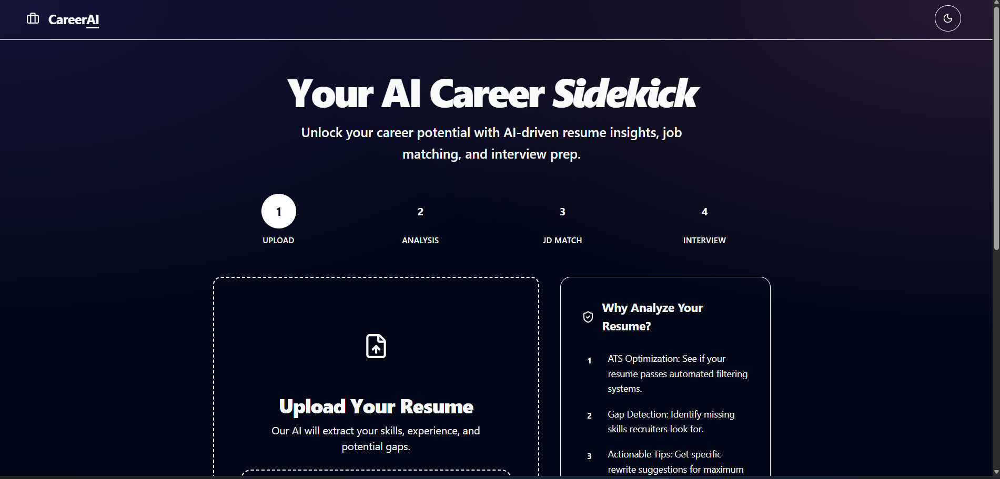
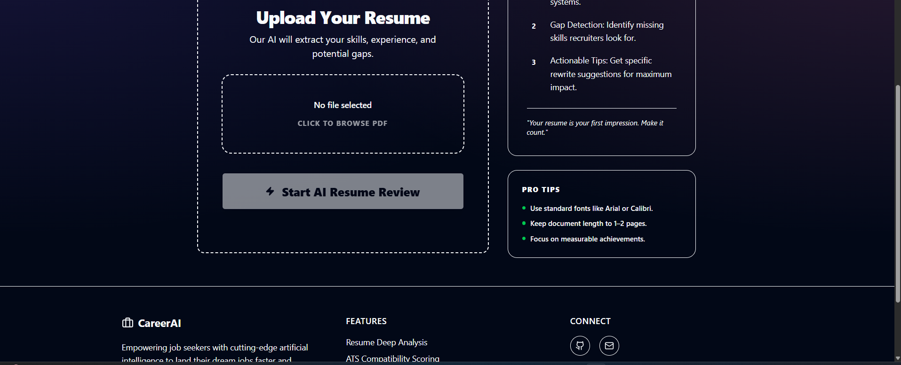

# AI Resume & Career Assistant 🚀

An AI-powered career assistant that helps job seekers build better resumes, match them with job descriptions, and prepare for interviews using LLMs.

---

## 📌 Overview

The **AI Resume & Career Assistant** streamlines the job application process by providing:

- **Resume Analysis**: AI-driven feedback on strengths, weaknesses, and ATS optimization.
- **JD Matching**: Real-time matching of your resume against specific job descriptions.
- **Interview Prep**: Automated generation of technical and behavioral questions tailored to your profile.

---

## ✨ Key Features

### 📄 AI Resume Analysis

- Upload your resume in **PDF format**.
- Automatic text extraction using `pdfplumber`.
- Detailed feedback on bullet points, skills, and formatting.

### 🔍 JD → Resume Matching

- Paste a job description to see how well you fit.
- Get a **match score (0-100)**.
- Identify missing skills and keyword gaps.

### 🎤 Interview Preparation

- Generates **customized interview questions** based on both your resume and the target JD.
- Includes sample answers to help you prepare effectively.

---

## 🏗️ Tech Stack

### Frontend

- **React 19** (TypeScript)
- **Vite** (Fast build tool)
- **Tailwind CSS 4** (Modern styling)
- **Shadcn UI** (Accessible components)
- **Axios** (API requests)

### Backend

- **FastAPI** (High-performance Python framework)
- **OpenAI API** (GPT-4o-mini)
- **pdfplumber** (PDF text extraction)
- **Pydantic** (Data validation)

---

## 📂 Project Structure

```text
Ai-Resume-Career-Assistant/
├── backend/
│   ├── main.py            # FastAPI entry point
│   ├── ai_service.py      # OpenAI integration logic
│   ├── requirements.txt   # Backend dependencies
│   └── .env               # OpenAI API Key (needs to be created)
├── frontend/
│   ├── src/
│   │   ├── components/    # UI & Step components
│   │   ├── context/       # State management
│   │   └── lib/           # API helper (axios)
│   ├── package.json       # Frontend dependencies
│   └── .env               # VITE_API_BASE_URL (needs to be created)
└── README.md
```

---

## ▶️ How to Run

### 1. Set up Environment Variables

- Create a `.env` file in the `backend/` directory:

```env
OPENAI_API_KEY=your_openai_api_key_here
```

- Create a `.env` file in the `frontend/` directory:

```env
VITE_API_BASE_URL=http://127.0.0.1:8000
```

### 2. Run the Backend

```bash
cd backend
pip install -r requirements.txt
fastapi dev main.py
```

### 3. Run the Frontend in another terminal

```bash
cd frontend
npm install -- force  # To resolve any potential dependency conflicts because it  has a lot of dependencies and some of them are not compatible with each other
npm run dev
```

---

## 🖼️ Image




---

## 🧠 Ai logic

```code

 User Input                                                                                                                                                                                                                             
     |                                                                                                                                                                                                                                   
     v
  Frontend (React)                                                                                                                                                                                                                       
     |                                                                                                                                                                                                                                   
     |-- upload PDF --------------------> POST /analyze-resume                                                                                                                                                                           
     |-- paste JD + resume text --------> POST /match-jd                                                                                                                                                                                 
     |-- paste JD + resume text --------> POST /generate-interview                                                                                                                                                                       
     |                                                                                                                                                                                                                                   
     v                                                                                                                                                                                                                                   
  FastAPI Router                                                                                                                                                                                                                         
     |                                                                                                                                                                                                                                   
     |-- /analyze-resume                                                                                                                                                                                                                 
     |     -> extract PDF text with pdfplumber                                                                                                                                                                                           
     |     -> trim to 4000 chars                                                                                                                                                                                                         
     |     -> call OpenAI                                                                                                                                                                                                                
     |     -> return strict JSON
     |                                                                                                                                                                                                                                   
     |-- /match-jd                                                                                                                                                                                                                       
     |     -> validate request with Pydantic                                                                                                                                                                                             
     |     -> trim resume/jd to 4000 chars                                                                                                                                                                                               
     |     -> call OpenAI                                                                                                                                                                                                                
     |     -> return strict JSON                                                                                                                                                                                                         
     |                                                                                                                                                                                                                                   
     |-- /generate-interview                                                                                                                                                                                                             
           -> validate request with Pydantic                                                                                                                                                                                             
           -> trim resume/jd to 4000 chars                                                                                                                                                                                               
           -> call OpenAI                                                                                                                                                                                                                
           -> return strict JSON                                                                                                                                                                                                         
                                                                                                                                                                                                                                         
  LLM Layer                                                                                                                                                                                                                              
     |                                                                                                                                                                                                                                   
     v                                                                                                                                                                                                                                   
  OpenAI AsyncOpenAI client                                                                                                                                                                                                              
     |                                                                                                                                                                                                                                   
     v                                                                                                                                                                                                                                   
  Prompt-based response generation                                                                                                                                                                                                       
     |                                                                                                                                                                                                                                   
     v                                                                                                                                                                                                                                   
  JSON parsed and sent back to frontend                                                                                                                                                                                                  
                                                      
```

---

## 🚀 Future Enhancements

- 💼 LinkedIn Profile Optimization.
- 📊 Resume Scoring & Version Tracking.
- 💾 User Dashboard with History (Database integration).
- ☁️ Deployment on AWS / Vercel.

---

## 🏁 Conclusion

The **AI Resume & Career Assistant** demonstrates the power of integrating LLMs into full-stack applications to solve real-world productivity challenges.

- 📌 **Status:** V1.0 Complete ✅
- 🚀 **Category:** Full-Stack AI Application
- 🎯 **Target Users:** Job Seekers, Students, Career Switchers
